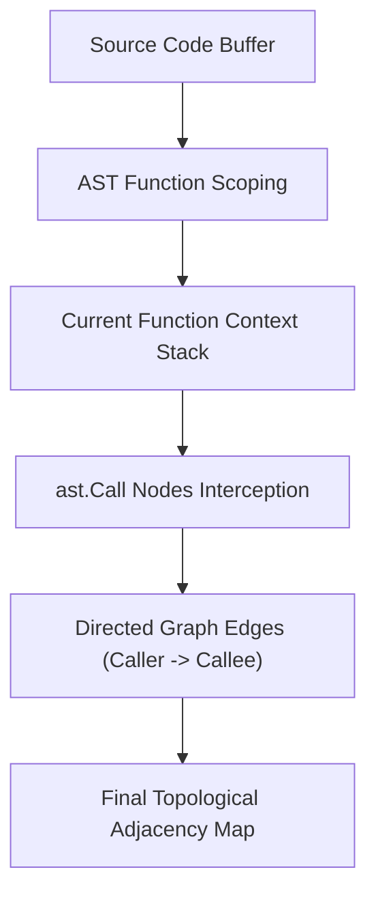

# genpark-code-call-graph-dependency-extractor-skill

Agent Skill implementing **Static Function Call Graph & Code Dependency Extraction** in 100% Python standard library.

## Architectural Flow

```mermaid
flowchart TD
    Src["Source Code Buffer"] --> AST["AST Function Scoping"]
    AST --> Tracker["Current Function Context Stack"]
    Tracker --> Calls["ast.Call Nodes Interception"]
    Calls --> Edges["Directed Graph Edges (Caller -> Callee)"]
    Edges --> Graph["Final Topological Adjacency Map"]
```
